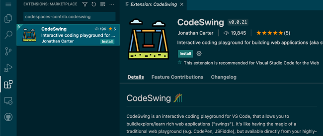
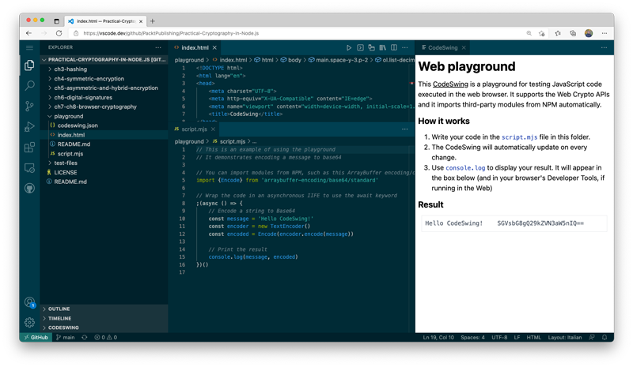

# Web Cryptography Playground

This playground, built with the [CodeSwing](https://marketplace.visualstudio.com/items?itemName=codespaces-Contrib.codeswing) extension for Visual Studio Code, can be used to experiment with code for cryptography in the browser.

You can use this playground in your browser with VS Code for the Web or in a desktop VS Code app.

## In your browser

> This experience works best in Chrome, Edge, Firefox, or other Chromium-based browsers.

To get started with this playground in your browser:

1. [Open this repository](https://vscode.dev/github/PacktPublishing/Practical-Cryptography-in-Node.js) in VS Code for the Web (aka _vscode.dev_)
2. If you haven't installed it already, search for the CodeSwing extension (`codespaces-contrib.codeswing`) and install it.  
  
3. Open the VS Code command palette (`CTRL + SHIFT + P` on Windows/Linux or `CMD + SHIFT + P` on macOS; it can be found in the "View" menu as well) and type `> CodeSwing: Open Swing`
4. Wait for a few moments while the CodeSwing extension is initialized, then choose the `playground` folder (full path displayed is `/PacktPublishing/Practical-Cryptography-in-Node.js/playground/`)

## In VS Code

The playground also works in the desktop [Visual Studio Code](https://code.visualstudio.com/) apps:

1. Clone this repository:  
  
  ```sh
  git clone https://github.com/PacktPublishing/Practical-Cryptography-in-Node.js.git
  ```
  
2. Open the folder with the source code in VS Code (using the terminal, you can type `code Practical-Cryptography-in-Node.js`)
3. If you haven't installed it already, search for the CodeSwing extension (`codespaces-contrib.codeswing`) and install it.
4. Open the VS Code command palette (`CTRL + SHIFT + P` on Windows/Linux or `CMD + SHIFT + P` on macOS; it can be found in the "View" menu as well) and type `> CodeSwing: Open Swing`
5. Choose the `playground` folder

## Using the playground

Because the playground uses CodeSwing, your code is on the left side and the results are on the right.



Type your code in the **`script.mjs`** file that is automatically opened (feel free to close or ignore the `index.html` file that appears too). The code is automatically executed as you type, and you should be able to see the results on the right side.

To show values in the "Results" section, make calls to `console.log` in your code as you'd normally do in JavaScript. If you're running the playground in your browser, you can also see the output of those invocations in your browser's developer tools.

The playground allows importing modules from NPM automatically too, by using the usual `import` syntax.
